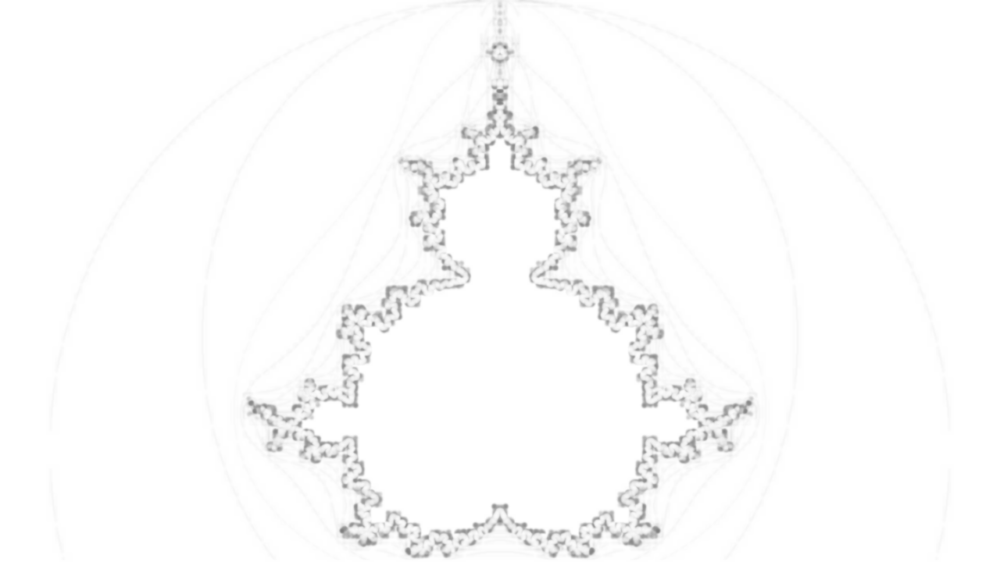

# validatessim sample


[Documentation](https://gitlab.freedesktop.org/gstreamer/gstreamer/-/blob/main/subprojects/gst-devtools/docs/plugins/ssim.md)


## Documentation example

```
rm -rf /tmp/test && mkdir -p /tmp/test
GST_VALIDATE_CONFIG=check_agingtv_ssim.config gst-validate-1.0 uridecodebin uri=https://media.w3.org/2010/05/sintel/trailer.mp4 ! videoconvert ! agingtv name=my_agingtv ! videoconvert ! autovideosink
```

## enc/dec example


* with min-avg-priority=0.95 (default): ✓
```
rm -rf /tmp/test && mkdir -p /tmp/test
GST_VALIDATE_CONFIG=check_dec_ssim.config gst-validate-1.0 gltestsrc pattern=mandelbrot  num-buffers=400 ! glcolorconvert ! gldownload ! video/x-raw,width=1280,height=720,framerate=30/1,format=I420 ! queue name=iraw ! mpeg2enc ! mpeg2dec name=dec ! videoconvert ! xvimagesink
```


* with min-avg-priority=0.999: ✗
```
rm -rf /tmp/test && mkdir -p /tmp/test
GST_VALIDATE_CONFIG=check_dec_999_ssim.config gst-validate-1.0 gltestsrc pattern=mandelbrot  num-buffers=400 ! glcolorconvert ! gldownload ! video/x-raw,width=1280,height=720,framerate=30/1,format=I420 ! queue name=iraw ! mpeg2enc ! mpeg2dec name=dec ! videoconvert ! xvimagesink
```


Note:

  
